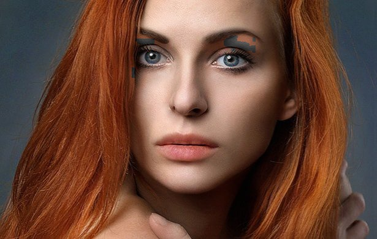
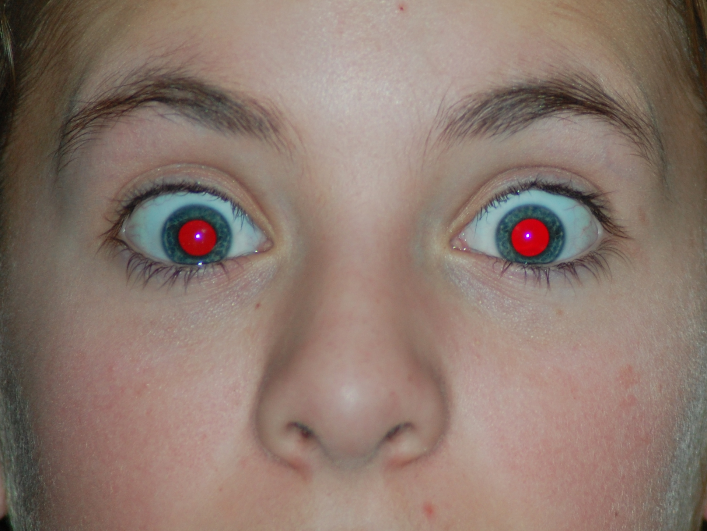
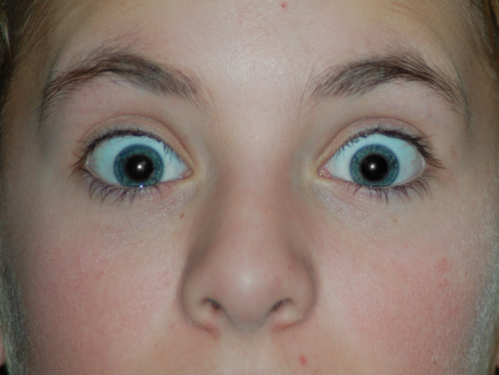
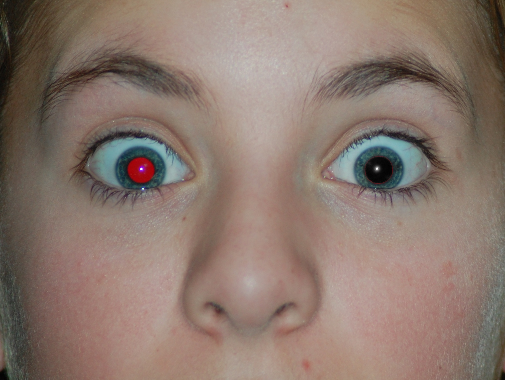
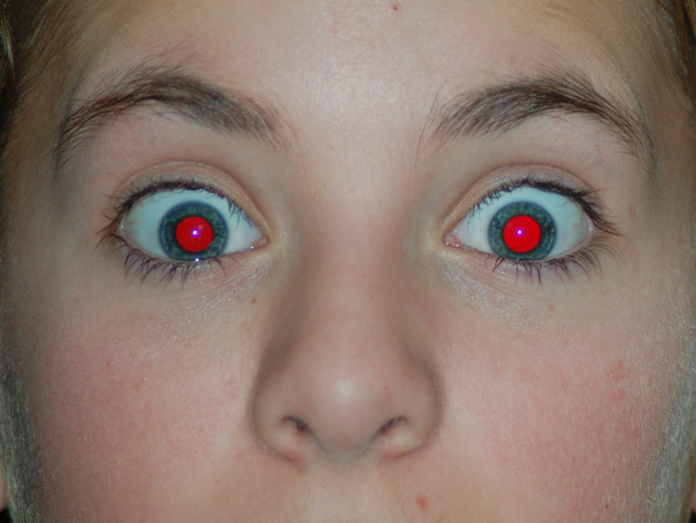
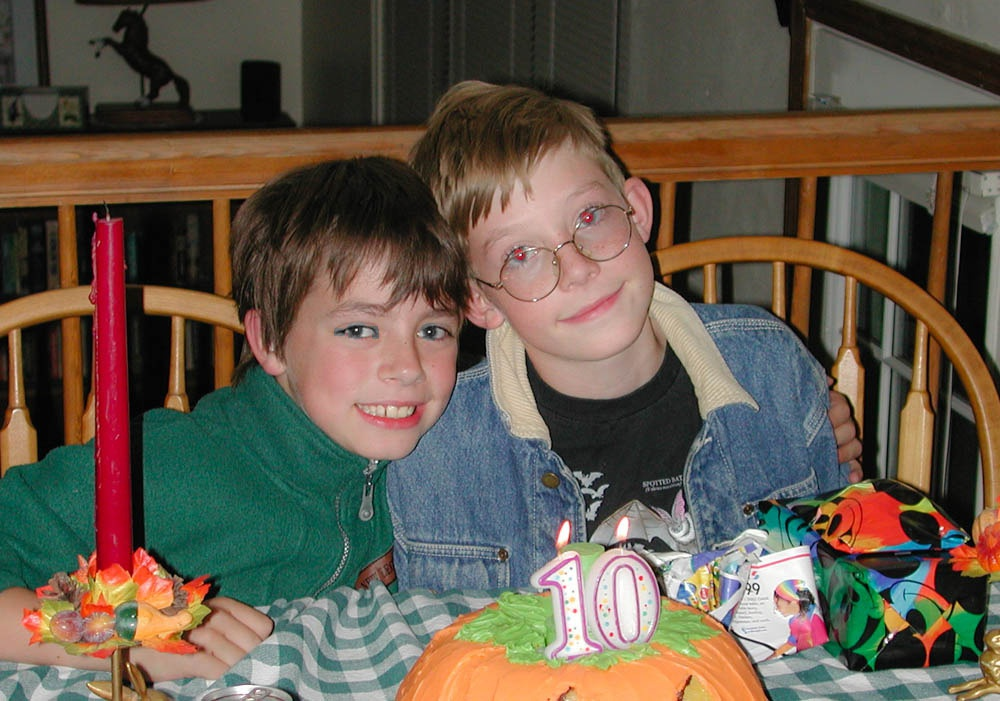

# Auto Red Eye Remover

Lei Mao

## Introduction

This is a simple automatic red eye remover implemented using OpenCV and C++. It uses a naive red eye detection and correction algorithm and works well in practice. More complicated algorithms could be found in literatures. 

## Dependencies

* GNU g++ 5.5.0 +
* CMake 3.5.1 +
* OpenCV 4.0.0 +
* Boost 1.58 +

## Installation

### Boost

```bash
$ sudo apt-get install libboost-all-dev
$ sudo apt-get install libcanberra-gtk-module
```

### CMake

```bash
$ sudo apt-get install cmake
```

## Usage

### Compile and Install

The executable ``AutoRedEyeRemoverApp`` was pre-compiled in Ubuntu 18.04. If you want to compile in your own environment, please run the following command in the terminal.

```bash
$ chmod +x install.sh
$ ./install
```

### Run

```bash
$ ./AutoRedEyeRemoverApp <image_filepath> [threshold]
```

The red eye removed image will be saved in the same directory to the image provided. 

The ``threshold`` argument is optional, and the default value is ``180``. Sometimes red eye removal will fail or the image after removal looks abnormal due to the default threshold is not appropriate. Try a value between ``0`` to ``255`` to see whether an optimal removal could be achieved. 

The algorithm uses eye detection algorithm to first detect eyes. If eye detection fails on the provided image, no red eye removal will happen. 

## Demo

The following demos were generated using the default parameters. Some red eyes were failed to be removed because either the eyes were not detected or the threshold parameter was not appropriate. Tuning ``threshold`` makes red eyes removed in most of the cases.

Raw | Threshold = 100 | Threshold = 180 (default) | Threshold = 220 |
:-------------------------:|:-------------------------:|:-------------------------:|:-------------------------:
 |  |  | 

Raw | Threshold = 100 | Threshold = 180 (default) | Threshold = 220 |
:-------------------------:|:-------------------------:|:-------------------------:|:-------------------------:
 |  |  | 

Raw | Threshold = 100 | Threshold = 180 (default) | Threshold = 220 |
:-------------------------:|:-------------------------:|:-------------------------:|:-------------------------:
 |  |  | 

Raw | Threshold = 100 | Threshold = 180 (default) | Threshold = 220 |
:-------------------------:|:-------------------------:|:-------------------------:|:-------------------------:
 |  |  | 


## Reference

* [Red Eye Removal Using OpenCV](https://www.learnopencv.com/automatic-red-eye-remover-using-opencv-cpp-python/)
